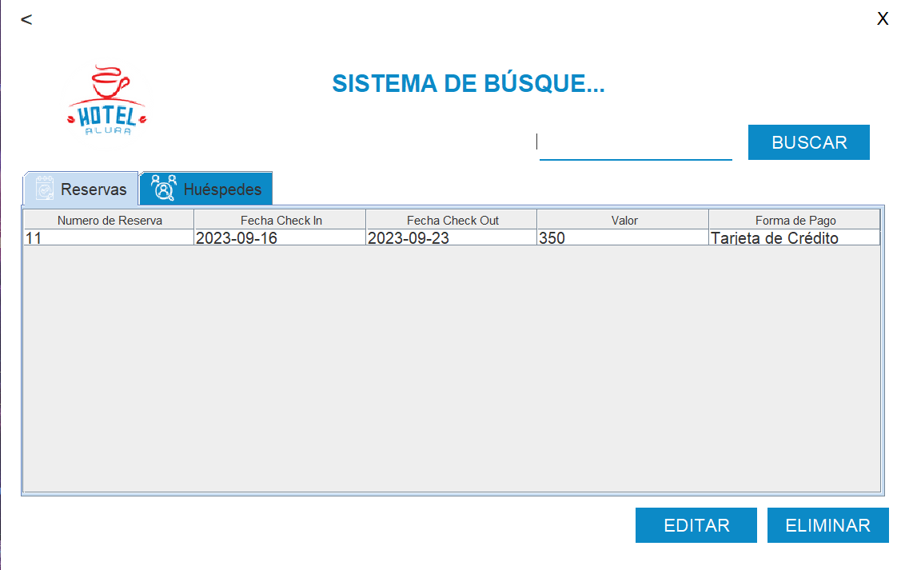

# Hotel Alura - Challenge Alura Backend

Este proyecto es parte del Challenge ONE Back End - Sprint 01: Crea tu propia aplicación Desktop con conexión a la Base de Datos.

Consiste en una aplicación de escritorio para la gestión de un hotel. Con una interfaz gráfica sencilla e intuitiva.
Que almacenará los datos de los huéspedes y las reservaciones en una base de datos MySQL.

## Características

- Acceso mediante usuario y contraseña.
- Registro de reservaciones.
- Registro de huéspedes.
- Consulta de reservaciones por id.
- Consulta de huéspedes por id.
- Consulta de huéspedes por apellido.
- edición de reservaciones.
- edición de huéspedes.
- Eliminación de reservaciones.
- Eliminación de huéspedes.

> **Nota:** El usuario y contraseña son almacenados en la misma base de datos.

## Capturas de pantalla

### Interfaz inicial

<table>
    <tr>
        <td></td>
        <td></td>
    </tr>
</table>

### Pantalla de Bienvenida

<td></td>

### Formularios de registro

<table>
    <tr>
        <td></td>
        <td></td>
    </tr>
<table>

### Listados y búsquedas

<table>
    <tr>
        <td></td>
        <td></td>
<table>

## Uso

1. Selecciona la opción login.
2. Ingresa el usuario y contraseña (por defecto ambos son `admin`).
3. Selecciona la opción que desees utilizar.
   3.1 Si seleccionas la opción de registro, llena los formularios (primero el de reservación y después el de huésped).
   3.2 Si seleccionas la opción de busqueda, se mostrarán los registros existentes. Puedes buscar por id o por apellido. Además, puedes editar o eliminar los registros existentes.
4. Es posible regresar a la pantalla anterior utilizando el botón de regresar (ubicado en la esquina superior izquierda).
5. Para salir de la aplicación, presiona el botón de salir (ubicado en la esquina superior derecha).

## Tecnologías utilizadas

- Java 17
- Visual Studio Code
- MySQL (con Docker)

## Ejecución

Antes de ejecutar la aplicación, es necesario tener instalado MySQL y en ejecución. Con las siguientes características:

- Usuario: root
- Contraseña: frost
- Puerto: 3306
- Nombre de la base de datos: hotelAlura
- tablas indicadas en el archivo [create tables.sql](./sql/create%20tables.sql)

> **Nota:** Se recomienda utilizar Docker para ejecutar MySQL. Para ello, necesita tener docker instalado y seguir los siguientes pasos:

### Ejecución con Docker

1. Descarga la carpeta [sql](./sql) desde la sección releases.
2. Abre una terminal en la carpeta sql.

   > **Nota:** Para cambiar el usuario y contraseña de acceso, modifica el archivo `sql` y cambia los valores que se insertan en la tabla `usuarios`.

3. Ejecuta el siguiente comando para construir la imagen con la base de datos.

```bash
docker build -t mysql-hotel-alura .
```

4. Ejecuta el siguiente comando para crear un contenedor con la base de datos.

```bash
docker run -d -p 3306:3306 --name mysql-hotel-alura mysql-hotel-alura
```

Una vez que el contenedor esté en ejecución o la base de datos esta funcionando localmente, puedes ejecutar la aplicación.

Descarga el archivo `Hotel Alura.jar` desde la sección releases y ejecútalo utilizando el siguiente comando.

```bash
java -jar "Hotel Alura.jar"
```

> **Nota:** Es necesario tener instalado Java 17 o superior.

## Contribución

Este proyecto forma parte del Challenge ONE Back End - Sprint 01: Crea tu propia aplicación Desktop con conexión a la Base de Datos. Aunque está diseñado como un ejercicio de aprendizaje, las contribuciones son bienvenidas. Si encuentras algún error, tienes alguna idea de mejora o deseas agregar nuevas funcionalidades, siéntete libre de hacerlo. ¡Tu participación es valorada!

Si tienes alguna duda relacionada con el proyecto o el Challenge ONE, también puedes compartirla. Estaré encantado de ayudarte.

## Autor

- [Raymundo Silvestre Gonzalez Contreras](https://github.com/RaymundoSGlz)

## Licencia

Este proyecto está bajo la [Licencia MIT](LICENSE).
